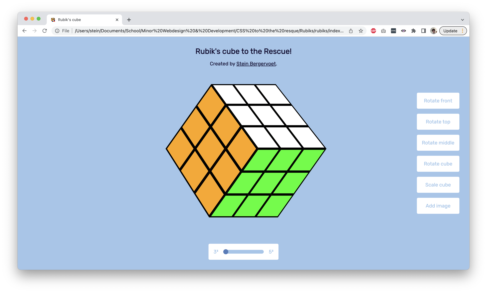
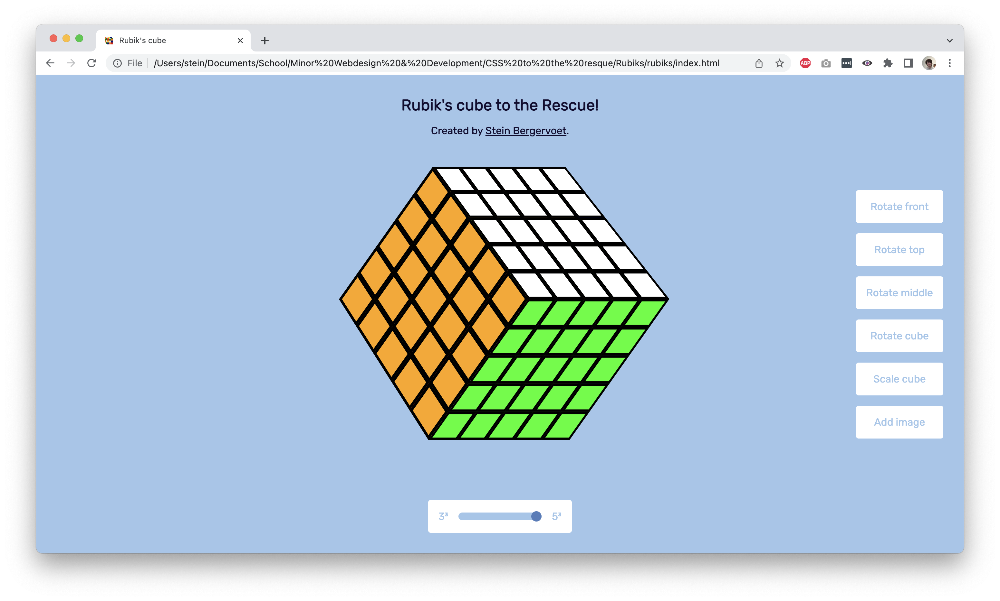

# Rubik's Cube to the Rescue!

This is a web-based project that displays a Rubik's Cube in the browser using only HTML and CSS.

## 3 by 3 Rubik's Cube

## 5 by 5 Rubik's Cube

## Live Site

View the live site [here](https://steinberg99.github.io/rubiks/).

## Description

Welcome! This repository hosts the website I produced during the course [CSS to the Rescue](https://github.com/cmda-minor-web/css-to-the-rescue-2223) of the minor [Web Design and Development](https://everythingweb.org/). During this course I was challenged to create a 3D Rubik's Cube, using only HTML and CSS. The only Javascript file I was allowed to use enabled me to use range inputs in CSS.

## Installation

> **NOTE:** Before you can install this project be sure you have [Git](https://git-scm.com/) installed on your local machine!

To install this project on your local machine clone the repository by running the following command:

`git clone https://github.com/Steinberg99/rubiks`

After running this command you can view the Rubik's cube by simply opening the `index.html` file located in the root folder of the project.

> **NOTE:** This project was made for version `110.0.5481.177` of Google Chrome.

## Process

The process of this project can be found in the [wiki](https://github.com/Steinberg99/rubiks/wiki) of this repository.

> **NOTE:** This wiki is written in Dutch!

# License

MIT License
